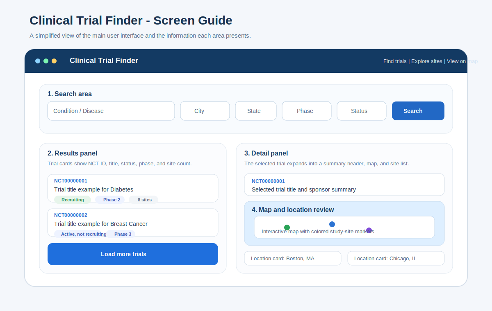
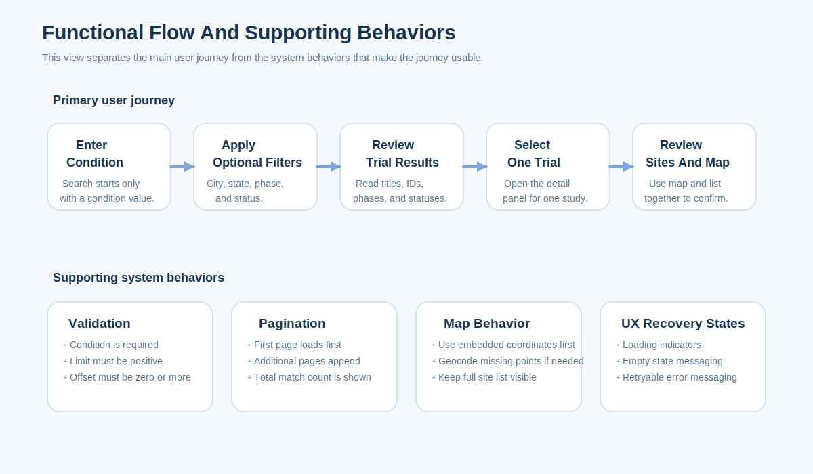

# Functional Specification

## Document Purpose

This document defines the expected business behavior of Clinical Trial Finder from a user and feature perspective. It focuses on what the system must do, what user outcomes it must support, and what conditions govern the experience.

*Figure 1. Start-to-end screen guide for the user-facing application flow.*

*Figure 2. End-to-end functional flow, including supporting system behaviors such as validation, pagination, and error handling.*

## Product Summary

Clinical Trial Finder is a comprehensive web application that enables a public user to search ClinicalTrials.gov studies, filter result sets, inspect trial summaries, review study site locations through both a map view and a structured location list, discover specialist physicians near trial sites, and capture interest for follow-up engagement.

## Business Objective

The product exists to reduce the effort required to move from a general condition search to a shortlist of relevant clinical studies and site locations, while connecting users with appropriate specialists and streamlining lead capture for research coordinators.

## Primary Actors

| Actor | Description | Main Goal |
| --- | --- | --- |
| Public user | A patient, caregiver, or researcher using the public interface | Find relevant clinical trials and review site locations |
| Support user | A staff member demonstrating or assisting with the product | Help another person understand search outcomes and site availability |

## In-Scope Capabilities

| Capability | Description | Priority |
| --- | --- | --- |
| Search by condition | Run a trial search using a required condition or disease term | High |
| Optional filters | Narrow the search by city, state, phase, and status | High |
| Paginated result list | Show the first page of trial summaries and allow more results to load | High |
| Trial detail review | Open one trial and inspect summary, description, and locations | High |
| Site mapping | Plot available site coordinates on a map | High |
| Physician search | Find specialist physicians near trial sites with automatic specialty matching | High |
| Auto-relax physician results | Expand specialty filter if fewer than 5 physicians found | High |
| Lead capture | Allow users to express interest in trials/physicians and submit contact information | High |
| Salesforce integration | Auto-push captured leads to Salesforce CRM for coordinator follow-up | Medium |
| Condition-specialty mapping | Map trial conditions to medical specialties using 4-pass resolution algorithm | High |
| City/state validation | Validate and suggest city/state combinations from indexed US locations | Medium |
| Graceful recovery states | Show loading, empty, and error states clearly | High |

## Out-Of-Scope Capabilities

- User authentication / login systems
- Saved searches or bookmarks
- Direct trial enrollment workflows
- Administrative management interface
- Persistent reporting or analytics dashboards
- Physician credentialing or verification (relies on NPPES registry)
- Insurance eligibility verification

## User Goals

1. Run a search quickly without needing training.
2. Narrow results without losing visibility into the original disease area.
3. Compare multiple studies from one result set.
4. Review location availability before opening an external registry page.
5. Find appropriate medical specialists near trial sites.
6. Express interest in trials/physicians and receive follow-up from research coordinators.
7. Access specialty-matched physicians automatically without manual research.

## End-To-End Functional Flow

1. The user lands on the home page.
2. The user enters a required condition.
3. The user may add optional filters (city, state, phase, status).
4. The system validates that a condition exists before running a search.
5. The system retrieves and filters studies.
6. The system displays a results list with summary cards.
7. The user selects one trial.
8. The system loads the site detail view.
9. The system shows a map and a complete site list when available.
10. The user clicks on a trial site location.
11. The system enables "Find Physicians" functionality for that site.
12. The system automatically maps the trial condition to specialist disciplines.
13. The system searches NPPES registry for physicians within selected radius.
14. If fewer than 5 results, the system auto-relaxes to parent specialties.
15. The system displays physician list with suggested related specialties.
16. The user captures lead interest for a trial and/or physician.
17. The system stores lead information securely.
18. The system optionally pushes lead to Salesforce for coordinator follow-up.

## Detailed Use Cases

### UC-01 Search For Trials

**Goal:** return a list of studies that match a condition and optional filters.

**Preconditions**

- The application is available.
- The user is on the main search page.

**Trigger**

- The user selects `Search Trials` or uses a quick condition chip.

**Main Success Flow**

1. The user enters a condition.
2. The user optionally adds city, state, phase, or status filters.
3. The user submits the search.
4. The system queries the trial data source.
5. The system returns the first page of matching studies.
6. The interface displays result cards and total match count.

**Alternative Flows**

- If the condition is empty, the system does not run the search.
- If no matches are returned, the system shows an empty state.
- If the search request fails, the system shows a retryable error state.

### UC-02 Load Additional Results

**Goal:** allow the user to continue exploring a longer match set.

**Main Success Flow**

1. The user reviews the current page of results.
2. The user selects `Load more trials`.
3. The system requests the next page using an updated offset.
4. The system appends additional trial cards to the existing list.

### UC-03 Review Trial Details And Sites

**Goal:** show deeper information for one selected study.

**Main Success Flow**

1. The user selects a trial card.
2. The system requests site detail for that trial.
3. The system loads the detail panel.
4. The system displays title, status, phases, sponsor, description, and sites.
5. The system plots mappable sites on the map.
6. The system displays all returned sites in a location list.

**Alternative Flow**

- If site detail fails to load, the system shows a site-level error message in the detail panel.

### UC-04 Inspect Sites On A Map

**Goal:** let the user understand geographic distribution quickly.

**Main Success Flow**

1. The user opens a trial with available site detail.
2. The system displays site markers using status-based colors.
3. The user hovers or selects a marker for facility detail.
4. The user may zoom or fit the map to all sites.
5. The user may select a site card to center the map on that location.

### UC-05 Search For Physicians Near A Trial Site

**Goal:** help users find specialist physicians near clinical trial locations.

**Preconditions**

- A trial detail panel is open.
- At least one site has valid coordinates.

**Trigger**

- The user selects a trial site (on map or in location list).
- The user clicks "Find Physicians".

**Main Success Flow**

1. The system maps the trial condition to one or more medical specialties.
2. The system retrieves ZIP codes within the selected radius around the site.
3. The system queries NPPES registry for physicians in those ZIPs with matched specialty.
4. The system geocodes addresses for physicians missing coordinates.
5. The system calculates distance and sorts by proximity.
6. The system displays up to 10 physicians with NPI, name, address, and distance.
7. The system suggests related specialties (up to 5) that may be relevant.
8. The system displays an auto-relaxation notice if specialty was broadened to find results.

**Alternative Flows**

- If fewer than 5 physicians found in initial specialty, system auto-relaxes to parent/related specialties (Level 1).
- If still fewer than 5, system tries domain-specific fallbacks (Level 2).
- If still fewer than 5, system tries Internal Medicine as catch-all (Level 3).
- If no physicians found after all levels, system shows "No physicians found" with suggestion to broaden search.

### UC-06 Capture Lead Interest In Trial And/Or Physician

**Goal:** allow users to express interest and provide contact information for follow-up.

**Preconditions**

- User is viewing a trial detail or physician.

**Trigger**

- User clicks "Express Interest", "Capture Lead", or similar CTA.

**Main Success Flow**

1. A modal form appears with fields: Name, Email, Phone, NPI (optional), Message (optional).
2. The form is pre-populated with trial ID and/or physician NPI if applicable.
3. The user enters required information.
4. The user submits the form.
5. The system validates email format.
6. The system stores the lead in persistent JSON storage (backend/data/leads.json).
7. If Salesforce integration enabled, system submits to Salesforce Web-to-Lead form.
8. The system shows success message to user.
9. Research coordinators receive notification for follow-up.

**Alternative Flows**

- If email validation fails, system shows error and allows user to correct.
- If Salesforce push fails, system stores locally and logs error (data is not lost).
- If NPI field filled, system passes to Salesforce custom field for provider tracking.

## Functional Requirements

| ID | Requirement |
| --- | --- |
| FR-01 | The system shall require a `condition` value before executing a search. |
| FR-02 | The system shall accept optional `city`, `state`, `phase`, and `status` filters. |
| FR-03 | The system shall provide quick-start condition chips for common search terms. |
| FR-04 | The system shall retrieve studies from ClinicalTrials.gov using the supplied condition. |
| FR-05 | The system shall apply local filtering by city, state, phase, and status before returning results to the UI. |
| FR-06 | The system shall present trial results in pages of 10 records. |
| FR-07 | The system shall display total matched result count in the results area. |
| FR-08 | The system shall allow the user to load additional result pages when more matches exist. |
| FR-09 | The system shall display `NCT ID`, title, status, phase, and site count in each visible result card when available. |
| FR-10 | The system shall allow a user to select one trial from the result set. |
| FR-11 | The system shall retrieve site details for the selected trial by `NCT ID`. |
| FR-12 | The system shall display trial title, status, phases, sponsor, and description when available in the detail panel. |
| FR-13 | The system shall show returned site locations in both a map and a list view. |
| FR-14 | The system shall use embedded coordinates when they exist and attempt fallback geocoding when they do not. |
| FR-15 | The system shall color map markers based on recruitment status. |
| FR-16 | The system shall display loading states during both search and site detail retrieval. |
| FR-17 | The system shall display an empty state when no matching studies are found. |
| FR-18 | The system shall display recoverable error messaging when search or site retrieval fails. |
| FR-19 | The system shall map trial conditions to medical specialties using a 4-pass resolution algorithm (exact, prefix, substring, token overlap). |
| FR-20 | The system shall search NPPES registry for physicians within specified radius and matched specialty. |
| FR-21 | The system shall auto-relax specialty filters if fewer than 5 physicians are found across three levels (parent specialties, domain fallbacks, catch-all). |
| FR-22 | The system shall suggest related specialties (up to 5) that may be relevant to the trial condition. |
| FR-23 | The system shall provide a lead capture modal for trials and physicians with Name, Email, Phone, NPI, and Message fields. |
| FR-24 | The system shall validate email addresses and reject malformed entries. |
| FR-25 | The system shall store lead data securely in persistent JSON format. |
| FR-26 | The system shall auto-push captured leads to Salesforce Web-to-Lead when SF_OID is configured. |
| FR-27 | The system shall validate city/state combinations against indexed US locations before accepting search input. |
| FR-28 | The system shall provide HTTP caching headers (5 min for trial search, 24 hr for site detail, 30 days for static data). |

## Validation Rules

- Search cannot proceed without a non-empty condition value.
- `limit` must be at least 1.
- `offset` must be 0 or greater.
- Empty optional filters must not block a search.
- Trial site detail must be tied to a specific `NCT ID`.

## Business Rules

- The current implementation restricts search results to studies with US locations.
- City and state filtering is based on the normalized location values returned for a study.
- Site status falls back to the study-level status when a site-specific status is missing.
- Frontend pagination is fixed to 10 records per page.
- The map is a convenience view and does not replace the full site list.

## State And UX Expectations

| State | Expected Behavior |
| --- | --- |
| Initial state | Show the full search experience with no results panel |
| Search loading | Show a visible loading indicator in the results area |
| Search success | Show result cards and result count |
| Search empty | Show a friendly no-results state with guidance |
| Search failure | Show an error message and retry option |
| Trial selected | Highlight the selected trial and open the detail panel |
| Site loading | Show a loading indicator in the detail panel |
| Site failure | Show a site-specific error state without destroying the result list |

## Data Visibility Requirements

- The user shall see a study identifier for every displayed trial.
- The user shall see a readable study title for every displayed trial.
- The user shall see the number of visible trials and the total matched count.
- The user shall see all returned sites in list form, even if some sites cannot be mapped.

## Non-Functional Expectations

- The interface should be usable on desktop and mobile layouts.
- External failures should degrade gracefully rather than crash the UI.
- The backend should expose a simple `/health` endpoint for operational checks.
- The application should keep the search interaction understandable for a first-time user.

## Acceptance Summary

The feature set should be considered functionally complete when a first-time user can:

1. Search by condition.
2. Narrow the search with optional filters.
3. Review a paginated result list.
4. Open one trial and view site detail.
5. Use both the map and the location list without confusion.
