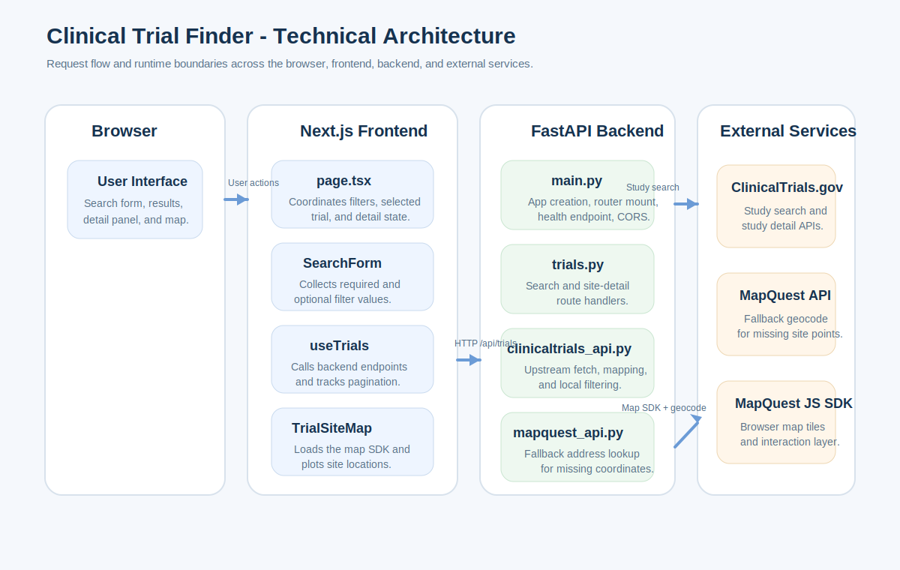
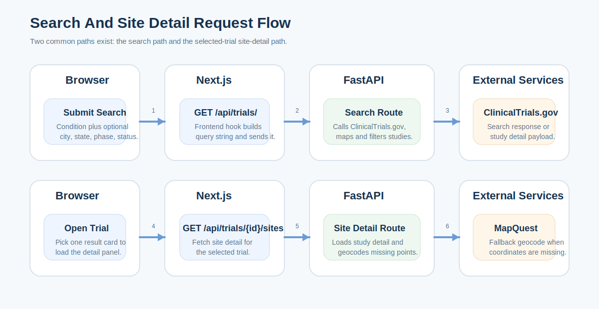

# Technical Specification

## Overview

Clinical Trial Finder is implemented as a Next.js frontend paired with a FastAPI backend. The frontend handles user input, list rendering, and map-based site review. The backend queries ClinicalTrials.gov, transforms upstream study data into an application-specific shape, and enriches missing coordinates through a fallback MapQuest geocoding step.



*Figure 1. Runtime architecture showing the browser, Next.js frontend, FastAPI backend, and external dependencies.*

## Design Goals

- Keep the product simple enough to deploy as a small two-tier application
- Use public clinical trial data without introducing a local database
- Provide a fast search-to-detail workflow in a single page
- Support geographic exploration without making the map the only source of truth
- Degrade safely when external services fail or return partial data

## Runtime Topology

| Layer | Technology | Responsibility |
| --- | --- | --- |
| Browser | React client runtime | Render UI, submit searches, display results and map |
| Frontend app | Next.js 15 + TypeScript | Route handling, page composition, API proxy rewrites |
| Backend API | FastAPI + Uvicorn | Search endpoints, normalization, pagination metadata |
| External trial source | ClinicalTrials.gov API v2 | Upstream study search and study detail |
| Geocoding service | MapQuest Geocoding API | Fallback latitude and longitude lookup |
| Map SDK | MapQuest JS SDK | Browser-side interactive map rendering |

## Repository Structure

| Path | Purpose |
| --- | --- |
| `backend/main.py` | FastAPI app creation, CORS setup, health endpoint |
| `backend/trials.py` | API routes for search and site detail |
| `backend/clinicaltrials_api.py` | Upstream study fetch, mapping, local filtering |
| `backend/mapquest_api.py` | Fallback address geocoding |
| `frontend/page.tsx` | Main client page and UI orchestration |
| `frontend/SearchForm.tsx` | Search form and quick filters |
| `frontend/TrialList.tsx` | Results list and load-more action |
| `frontend/TrialSiteMap.tsx` | Map, summary counters, and site list |
| `frontend/useTrials.ts` | Client data fetching and pagination state |
| `docs/` | Project documentation and embedded diagrams |

## Frontend Design

### Primary Components

| Component | Responsibility |
| --- | --- |
| `SearchForm` | Collect the required condition and optional filters |
| `useTrials` | Execute search requests, track loading and pagination state |
| `TrialList` | Render the trial cards and load-more control |
| `TrialSiteMap` | Render site metrics, map markers, legend, and location cards |
| `page.tsx` | Coordinate filters, selected trial, and detail panel state |

### Frontend Request Behavior

1. The user submits search criteria from `SearchForm`.
2. `page.tsx` stores the active filter set in local state.
3. `useTrials` calls `GET /api/trials/` using `condition`, filters, `limit`, and `offset`.
4. The results list updates with the returned trial page.
5. When the user selects a trial, `page.tsx` calls `fetchTrialSites`.
6. `TrialSiteMap` receives site data and renders map plus list views.

### Frontend Pagination Model

- The page size is fixed at 10 records.
- Additional pages are fetched incrementally rather than replacing the list.
- `totalCount` and `hasMore` are derived from backend pagination metadata.

## Backend Design

### FastAPI Application

`backend/main.py` creates the application and mounts the trials router under `/api/trials`. It also exposes `GET /health` for readiness checks. The current code uses permissive CORS with `allow_origins=["*"]`.

### Search Pipeline

`backend/trials.py` accepts query parameters and builds the filter object used by `fetch_trials_with_filters`.

`backend/clinicaltrials_api.py` is responsible for:

- requesting study pages from ClinicalTrials.gov
- mapping the upstream payload into the app response model
- normalizing strings for local filtering
- applying phase, status, city, and state filters
- returning a sliced result set plus total matched count

The current upstream fetch strategy uses:

- `DEFAULT_PAGE_SIZE = 100`
- `MAX_PAGES = 10`
- local pagination through `limit` and `offset`

### Site Detail Pipeline

`GET /api/trials/{nct_id}/sites` loads one study detail record and extracts site-level locations. When a site does not include embedded coordinates, the backend builds a location string and passes it to `mapquest_api.py` for fallback geocoding.

## Request Lifecycles



*Figure 2. Search and site-detail request lifecycles across the browser, frontend, backend, and external services.*

### Search Request Lifecycle

1. The browser submits search filters.
2. The frontend constructs `GET /api/trials/?condition=...`.
3. The backend queries ClinicalTrials.gov with `query.cond`.
4. The backend maps and filters returned studies.
5. The backend returns `trials` plus `pagination`.
6. The frontend updates the results list and `hasMore` state.

### Site Detail Request Lifecycle

1. The user selects a trial from the list.
2. The frontend requests `GET /api/trials/{nct_id}/sites`.
3. The backend fetches study detail from ClinicalTrials.gov.
4. The backend uses embedded coordinates when available.
5. The backend geocodes missing coordinates through MapQuest when needed.
6. The frontend renders the site map and the full location list.

## API Surface

### `GET /health`

| Attribute | Value |
| --- | --- |
| Purpose | Health or readiness check |
| Response | `{"status": "ok"}` |

### `GET /api/trials/`

| Parameter | Required | Notes |
| --- | --- | --- |
| `condition` | Yes | Main search term |
| `city` | No | Optional local filter |
| `state` | No | Optional local filter |
| `status` | No | Optional local filter |
| `phase` | No | Optional local filter |
| `limit` | No | Defaults to 10 in frontend usage |
| `offset` | No | Used for pagination |

Example response:

```json
{
  "condition": "Diabetes",
  "trials": [
    {
      "nctId": "NCT00000000",
      "title": "Example Trial",
      "status": "RECRUITING",
      "description": "Example summary",
      "conditions": ["Diabetes"],
      "sponsor": "Example Sponsor",
      "phases": ["PHASE1"],
      "locations": []
    }
  ],
  "pagination": {
    "limit": 10,
    "offset": 0,
    "total": 1,
    "page": 1,
    "has_more": false
  }
}
```

### `GET /api/trials/{nct_id}/sites`

| Attribute | Value |
| --- | --- |
| Purpose | Return site locations for one study |
| Key identifier | `nct_id` |
| Output | Title, study status, and list of site objects |

Example response:

```json
{
  "nctId": "NCT00000000",
  "title": "Example Trial",
  "status": "RECRUITING",
  "sites": [
    {
      "facility": "Example Hospital",
      "city": "Boston",
      "state": "MA",
      "country": "United States",
      "status": "RECRUITING",
      "lat": 42.36,
      "lon": -71.05
    }
  ]
}
```

## Data Contracts

### Trial Model

| Field | Type | Notes |
| --- | --- | --- |
| `nctId` | string | Study identifier |
| `title` | string | Brief title |
| `status` | string | Overall study status |
| `description` | string or null | Brief summary |
| `conditions` | string[] | Conditions list |
| `sponsor` | string or null | Lead sponsor |
| `phases` | string[] | Study phase list |
| `locations` | TrialLocation[] | Returned location list |
| `inclusionCriteria` | string or undefined | Currently passed through when available |
| `exclusionCriteria` | string or undefined | Currently null in mapped output |
| `pointOfContact` | object or null | First central contact when present |

### Trial Location Model

| Field | Type |
| --- | --- |
| `facility` | string or null |
| `city` | string or null |
| `state` | string or null |
| `country` | string or null |
| `status` | string or null |
| `lat` | number or null |
| `lon` | number or null |

## Configuration

### Frontend Environment Variables

| Variable | Purpose |
| --- | --- |
| `API_URL` | Preferred backend URL for Next.js rewrite proxying |
| `NEXT_PUBLIC_API_URL` | Optional direct browser-visible backend URL |
| `NEXT_PUBLIC_MAPQUEST_KEY` | Browser-side key required for map rendering |

### Backend Environment Variables

| Variable | Purpose |
| --- | --- |
| `MAPQUEST_API_KEY` | Server-side key used for fallback geocoding |

## Deployment Model

- Frontend is intended to deploy from `frontend/` on Vercel.
- Backend is intended to deploy as a Render web service.
- Next.js rewrites can proxy `/api/*` and `/health` to the backend.
- The frontend can run locally against `http://localhost:8000` in development.

## Operational Notes

- The map requires browser access to the MapQuest JS SDK.
- The backend depends on both ClinicalTrials.gov and MapQuest availability.
- The project currently has no persistence layer.
- The project currently has no automated test suite in the repository.

## Technical Risks And Limitations

- The 10-page upstream cap can undercount deeper result sets for broad conditions.
- Local post-fetch filtering means upstream queries are not fully optimized for all filters.
- Permissive CORS may be too open for a stricter production posture.
- Some studies may return partial site coordinates, leaving the list more complete than the map.

## Recommended Next Improvements

1. Tighten CORS configuration for production deployments.
2. Add automated tests for search mapping and site-detail behavior.
3. Improve upstream query strategy to reduce reliance on post-fetch filtering.
4. Add structured logging and monitoring for external API failures.
