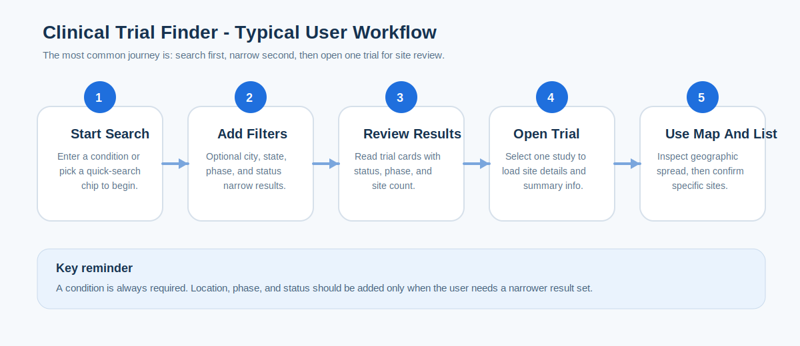

# User Playbook

Clinical Trial Finder is a comprehensive web application for discovering clinical trials and finding specialist physicians near trial sites. It helps users move from a disease search to matching trials, then to nearby physicians who specialize in that condition.

## Visual Walkthrough

### Start-To-End Screen Guide

*Figure 1. Start-to-end screen guide for the search, results, and site review experience.*

Source asset: `docs/assets/playbook-screen-guide.svg`

## Quick Summary

| Item | Details |
| --- | --- |
| Primary purpose | Search public clinical trials, review study sites, and find specialist physicians |
| Main input | Condition or disease name |
| Optional filters | City, state, phase, status, radius (for physician search) |
| Main outputs | Trial list, study summary, site map, site location list, physician directory, AI physician insights, lead capture |
| External data sources | ClinicalTrials.gov, NPPES Physician Registry, MapQuest Geocoding, OpenAlex, PubMed, Europe PMC, Groq |
| Map dependency | MapQuest browser key for interactive map display |
| CRM integration | Optional Salesforce lead capture and auto-push |

## What This Application Helps You Do

- Search for trials by disease, condition, or keyword
- Narrow a search to a city, US state, recruitment status, or trial phase
- Review a compact list of studies with IDs, phases, and statuses
- Open one trial and inspect all returned study locations
- View site locations on an interactive map when coordinates are available
- **Find specialist physicians near trial sites** with automatic specialty matching
- **View AI-enriched physician summaries** with publication metrics, research areas, and concise expertise overviews
- **Capture your interest** in a trial and/or physician by providing contact information
- **Auto-connect with providers** via optional Salesforce integration for follow-up

### Search To Review Workflow

*Figure 2. Typical user workflow from search entry to reviewing site locations.*

## Who Should Use This Playbook

- Patients or caregivers looking for publicly listed study opportunities
- Research or operations staff doing quick trial discovery
- Demo, support, or onboarding teams explaining the application to new users

## Before You Start

- The application requires a value in `Condition / Disease` before it will search.
- Results are based on live or near-live responses from ClinicalTrials.gov.
- The current implementation only returns studies with US-based locations.
- The map experience works best when `NEXT_PUBLIC_MAPQUEST_KEY` is configured.
- Physician search automatically matches specialties to your condition and expands the search radius if fewer than 5 results are found.
- AI physician insights may require `GROQ_API_KEY` and will surface publication metrics, research areas, and a concise physician summary.
- The application does not enroll a participant into a study. It is strictly for search, review, and provider discovery.
- Lead capture information is securely stored and can be pushed to Salesforce for follow-up by research coordinators.

## Screen Guide

### 1. Search Area

The top search area is where the user starts. It contains:

- `Condition / Disease` as the required field
- `City` as an optional narrowing filter (with city/state validation)
- `State` as an optional US state filter
- `Phase` as an optional study phase filter
- `Status` as an optional study recruitment filter
- Quick condition chips for common searches (1000+ city/state combinations available)

### 2. Results Panel

After a search runs, the left side of the interface becomes the trial results panel. Each card typically shows:

- `NCT ID`
- Brief study title
- Recruitment status
- Trial phase
- Number of known sites

### 3. Detail Panel

When a result is selected, the right side becomes the detail panel. It presents:

- Study title
- Overall trial status
- Sponsor, when available
- Study description
- Inclusion and exclusion criteria
- A site map
- A complete location list
- **Physician Search** button to find specialists near selected trial sites

### 4. Physician Panel (New)

When you search for physicians near a trial site, you'll see:

- A map showing nearby physicians
- Radius control slider (5, 10, 25, 50, 100 miles)
- A list of specialists with their NPI, name, address, and distance
- **Suggested specialists** (related subspecialties)
- Auto-expansion notice if the specialty was relaxed to find more results

### 5. Lead Capture Modal (New)

You can express interest in a trial and/or physician by:

- Entering your name, email, and phone
- Optionally providing your NPI (if you're a healthcare provider)
- Submitting your information
- Your information is stored securely and may be sent to research coordinators for follow-up

## Search Inputs Explained

| Field | Required | What It Does | Best Practice |
| --- | --- | --- | --- |
| Condition / Disease | Yes | Starts the search against ClinicalTrials.gov | Use a common disease name first, then narrow later |
| City | No | Narrows matches to studies with a site in a specific city | Use with a state when the city name is common |
| State | No | Narrows matches to a US state | Useful when searching across large conditions |
| Phase | No | Filters by trial phase | Good when a user only wants later-stage studies |
| Status | No | Filters by recruitment or completion status | Use `Recruiting` first for active opportunity searches |

## Standard User Workflow

1. Open the application.
2. Enter a disease or condition in `Condition / Disease`.
3. Add optional filters only if needed.
4. Select `Search Trials`.
5. Review the results count and visible trial cards.
6. Select one trial to open site details.
7. Review the map and the `All Locations` list.
8. Use `Load more trials` if more result pages exist.

## What To Look For In Search Results

When reviewing the results list, the user should focus on:

- Whether the status is `Recruiting`, `Active`, or a completed state
- Whether the listed phase matches the purpose of the search
- Whether the site count suggests a broad or narrow site footprint
- Whether the title clearly matches the intended disease area

If the list is too small or empty, remove filters one at a time and search again.

## How To Review A Trial In Detail

After selecting a trial:

1. Check the `NCT ID` to confirm the study identity.
2. Review the sponsor and overall status.
3. Read the study summary to confirm the topic is relevant.
4. Use the map for a geographic overview.
5. Use the location cards for site-by-site review.

If a location card has coordinates, clicking it recenters the map around that site.

## Understanding The Map

The map is designed to help a user move quickly from a long list of sites to a visual geographic view.

- Green markers indicate recruiting or invitation-style enrollment states
- Blue markers indicate active but not necessarily recruiting sites
- Yellow and orange markers indicate warning or paused states
- Red markers indicate terminated sites
- Purple markers indicate completed sites
- Gray markers indicate other or unknown statuses

The map panel also includes:

- A total site count
- A recruiting site count
- An on-map site count
- A country count
- Zoom in and zoom out controls
- A fit-to-sites control

## Common Scenarios

### Scenario A: Find Recruiting Studies For A Condition

1. Enter the condition name.
2. Set `Status` to `Recruiting`.
3. Optionally choose a `State`.
4. Run the search.
5. Review the first result page and open the most relevant trial.

### Scenario B: Review Study Sites Near One City

1. Enter the condition name.
2. Add a `City` and `State`.
3. Run the search.
4. Select a trial from the filtered list.
5. Review the right-side panel to confirm nearby locations.

### Scenario C: Compare Multiple Trials

1. Search once using only the condition.
2. Review the first page of results without over-filtering.
3. Open one trial at a time to inspect sponsor, phase, and site count.
4. Use `Load more trials` if the first page is not enough.

### Scenario D: Find Physicians Near A Trial Site (New)

1. Search for and select a trial.
2. Review the trial details and sites.
3. Click a trial site on the map or in the location list.
4. The "Find Physicians" button appears.
5. Adjust the search radius (default 25 miles).
6. Review the list of nearby specialists in the matched specialty.
7. Click a physician to center the map on their location and optionally view AI Insights.
8. Optionally capture your interest in the physician via the lead form.

### Scenario E: Capture Your Interest And Get Follow-Up (New)

1. Find a trial or physician you're interested in.
2. Click "Express Interest" or "Capture Lead".
3. Fill in your name, email, phone, and optional NPI.
4. Submit the form.
5. Your information is securely stored.
6. If Salesforce integration is enabled, a research coordinator will follow up with you.
7. Your information helps match you with study sites and coordinators.

## Good Search Practices

- Start broad and then narrow
- Prefer a standard disease name over an acronym on the first search
- Add location filters only after verifying that the condition returns results
- Use recruiting status when the goal is active opportunity discovery
- Use the study title and sponsor together before assuming a trial is relevant

## Troubleshooting Guide

| Issue | Likely Cause | What To Do |
| --- | --- | --- |
| No trials found | Search is too narrow or misspelled | Remove filters, broaden the condition, check spelling |
| Search failed | Backend is unavailable or upstream request failed | Retry the search and confirm the backend is running |
| Map is blank | Browser map key is missing or no coordinates were available | Confirm `NEXT_PUBLIC_MAPQUEST_KEY` and review the location list |
| Some sites do not appear on the map | A site had no usable latitude and longitude | Use the `All Locations` list as the fallback reference |
| Results look smaller than expected | US-only filtering or upstream page limits reduced the match set | Broaden the query or revisit backend filtering logic |

## Limitations To Keep In Mind

- The application does not support sign-in, saved searches, or bookmarks.
- The application currently limits discovery to studies with US locations.
- Study filtering is applied after data is fetched from ClinicalTrials.gov.
- The map depends on an external browser-side MapQuest integration.
- Physician search is limited to specialists registered in the NPPES (National Provider Enumeration System) registry.
- Physician auto-expansion (when fewer than 5 results are found) may relax specialty matching to parent or related specialties.
- Lead capture does not constitute enrollment; it only expresses interest for follow-up.
- The tool is informational and should not be treated as medical advice.
- Specialty matching uses a 4-pass algorithm: exact match → prefix match → substring match → token overlap.
